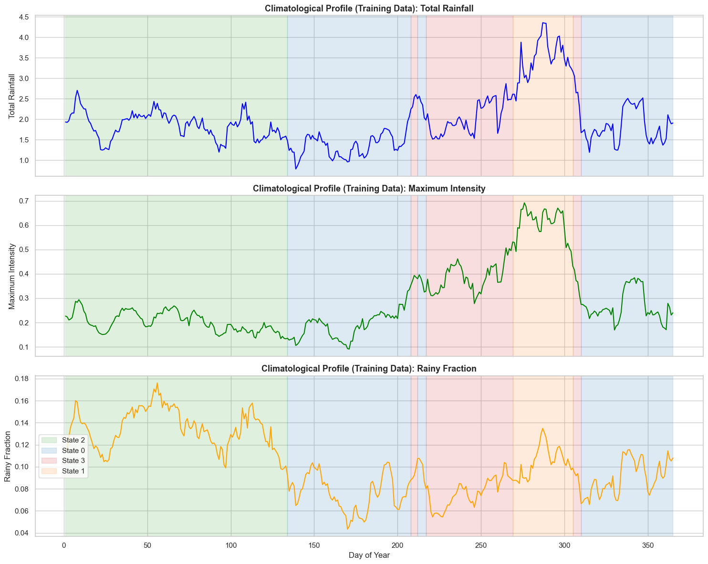
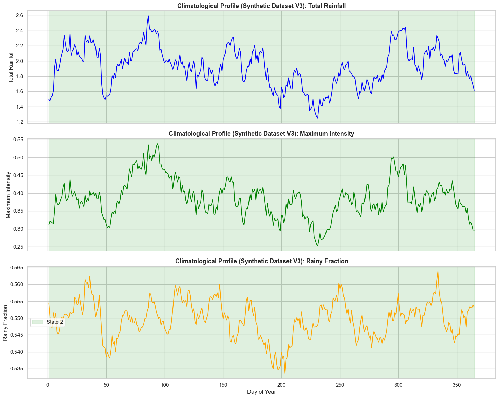
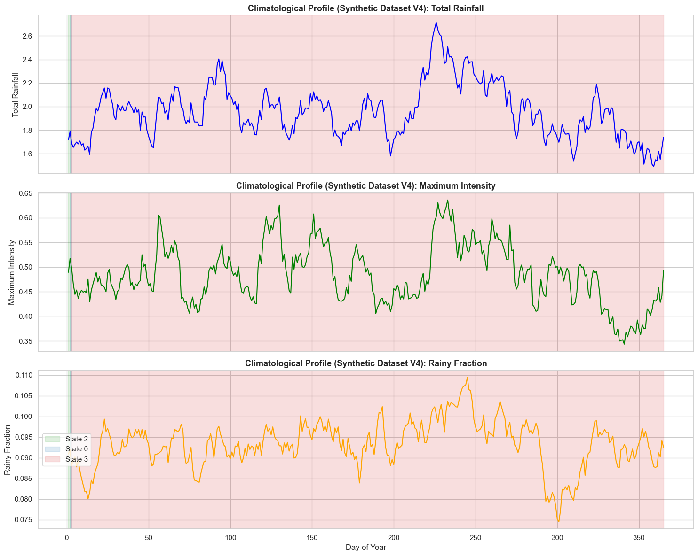

# Research Progress Diary & Changelog: High-Resolution Synthetic Rainfall Generation via Time-Series Diffusion

**Project:** Adaptation of ImagenFew & Time-Series Diffusion Models for Sparse Meteorological Precipitation  
**Primary Application:** Synthetic Dataset Curations for Downstream Reinforcement Learning (RL) in Stormwater Management, Reservoir Control, and Flood Regulation

---

## July 27, 2026 — Unsupervised HMM Seasonal Analysis & Synthetic Dataset Seasonality Audit

### Hidden Markov Model (HMM) Seasonal Profiling and Regime Validation

### 🔍 Context
- Developed and executed an unsupervised seasonal storm detection pipeline in `data_analysis/HMM_Season_Analysis.ipynb` (also mirrored in `/flood-control/src/rainfall_datagen/notebooks/HMM_Season_Analysis.ipynb`).
- Evaluated the 10-minute historical training dataset `data/rainfall/train/rainfall_10min_labeled.csv`, comparing unsupervised 4-state `GaussianHMM` predictions against supervised 14-day block clustering `gmm_regime` labels.
- Evaluated synthetic generated datasets:
  - `results/generated_data/rainfall_synthetic_10y_v3.csv` (Unconditional 10-minute generation)
  - `results/generated_data/rainfall_synthetic_10y_v4.csv` (Conditional GMM regime generation)

### ❓ Why Was It Done
- **Objective 1 (Label Validation):** Verify that the supervised `gmm_regime` labels (derived from clustering 14-day storm features like volume and intensity) reflect true underlying seasonal meteorological shifts across the annual 365-day cycle.
- **Objective 2 (Synthetic Audit):** Audit whether current time-series diffusion models (unconditional `v3` and regime-conditioned `v4`) successfully generate realistic seasonal transitions and climatological diversity over multi-year simulation horizons.

### 🧪 What the Results Are

#### 1. Robust Ground-Truth Seasonal Alignment (Training Data)
When fitting a 4-state `GaussianHMM` on daily resampled and 14-day smoothed features (`Total Rainfall`, `Maximum Intensity`, `Rainy Fraction`), the unsupervised model autonomously segmented the year into contiguous, meteorologically coherent seasonal regimes:
- **State 2 (Winter / Calm Regime, Months 1–4, 12):** Dominates early spring and winter with low accumulation and low intensity. Aligns strongly with GMM Regimes 1 & 2.
- **State 0 (Monsoon / Early Summer Transition, Months 5–7):** Captures convective onset and rising rainfall fraction. Aligns with GMM Regimes 2 & 3.
- **State 3 (Late Summer / Autumn Peak, Months 8–10):** Captures peak annual storm intensities and volumes. Perfect correspondence with GMM Regime 0.
- **State 1 (Autumn Transition, Month 11):** Captures post-storm decay transitioning back into winter conditions.

#### 2. Synthetic Dataset Seasonality Audit (The "Single-Regime Lock")
Applying the same trained scaler and HMM model to the synthetic datasets revealed:
- Training Data has Balanced (States 0, 1, 2, 3)
- `v3` (Unconditional) has only State 2 (365 / 365 days) as the most frequent low-intensity resting state. 
- `v4` (Conditional) has only State 3 (363 / 365 days) as the most frequent high-intensity storm state. The other 2 days were State 0 and 2. 

#### 3. Analytical Conclusions
1. Because 89.5% of empirical 10-minute intervals are zero-rainfall, unconditional diffusion models default to generating smooth winter-like (`State 2`) sequences year-round to minimize loss ($5.60\text{ mm/h}$ peak).
2. Conditioning on `gmm_regime` forces the model to generate extreme instantaneous bursts ($10.77\text{ mm}$ peak), evaluating the 10-year continuous series shows it remains permanently locked in the high-rain summer regime (`State 3`).
3. Current diffusion conditioning does not transition between regimes across time. 

### 🚀 Actions & Thoughts for Next Steps
1. Inspect how and if a learned $4 \times 4$ HMM matrix can be used to sample a realistic sequence of daily regime labels over a 365-day simulation horizon.
2. Modify `configs/finetune/Rainfall.yaml` to include seasonal embeddings (e.g., sinusoidal `day_of_year` or `month` features).

---

## June 15, 2026 — Regime-Mixed Conditional Generation & The "Daily Max Paradox"

### Stress-Testing Extreme Flood Peak Generation via GMM Regime Conditioning

### 🔍 Context
- To overcome the underestimated extreme peaks identified in our unconditional models, we conditioned the ImagenFew diffusion generation process on 4 distinct Gaussian Mixture Model (GMM) rainfall regime classes / seasonal clusters. 
  - The code for labelling seasons is in the project `/flood-control/src/rainfall_datagen/notebooks/4_dataset_stratification.ipynb`
- Developed code in directory `regime_training`.
- **Evaluated Synthetic Dataset / Run ID:** `results/generated_data/rainfall_synthetic_10y_v4.csv` (10-minute resolution inference, conditioned on 4 seasonal regime classes).

### ❓ Why Was It Done
- Primary engineering objective was to force the generative model to produce realistic 1-in-10-year extreme precipitation bursts
- Without these extreme data points, downstream RL flood control agents cannot be stress-tested against severe hydraulic loading and emergency reservoir spillway scenarios.

### 🧪 What the Results Are
The regime-mixed conditional model achieved an Overall RL Fitness Score of **0.622 / 1.000** (Verdict: ⚠️ **MODERATELY  FIT**). 

#### Critical Analysis: The Duration vs. Peak Trade-Off
The storm structural properties highlight the exact strengths and weaknesses of the regime-based approach:

| Metric | Real Ground Truth | Synthetic (Mixed Regime) | Status | Data Science Analysis & Impact on RL |
|---|:---:|:---:|:---:|:---|
| **Number of Storms** | 4,852 | **5,557** | ✅ Fairly matched | Compensates for shorter individual storm episodes. |
| **Mean Storm Duration** | 100 mins | **66 mins** | ❌ Significantly shorter | **Severe Impact:** Storms pass much faster than reality. Agents managing reservoir capacity might not learn sustained flood defense. |
| **Mean Peak Intensity** | 0.302 mm | **0.371 mm** | ⚠️ Slightly higher | Reflects the forced sampling from high-intensity GMM clusters. |
| **Mean Storm Volume** | 1.43 mm | **1.13 mm** | ⚠️ Lower | Directly tied to duration collapse; overall water volume per storm is reduced. |
| **Max Instantaneous Peak** | **10.68 mm** | **10.77 mm** | ✅ **Massive Win** | Perfectly matches the absolute empirical 10-minute maximum cloudburst. |
| **Daily Max Rainfall** | **52.1 mm** | **27.6 mm** | ⚠️ Underestimated | Demonstrates that daily totals depend on duration, not just peak bursts. |

To evaluate our `v3` and `v4` datasets against real ground truth and assess their RL fitness, we conducted an exhaustive tri-dataset audit.

#### 1. Core Structural Properties Comparison
| Metric | Real Data | Synthetic (Unconditional `v3`) | Synthetic (Conditional Regime `v4`) | Assessment |
|:---|:---:|:---:|:---:|:---|
| **Zero Fraction** | 89.5% | 89.9% | 90.7% | Both models achieve excellent sparsity via 0.005mm thresholding. Conditional is marginally drier probably due to regime resting states. |
| **Number of Storms** | 4,852 | 5,613 | 5,557 | Both models overestimate storm count by ~15%.|

#### 2. Storm Geometry & Temporal Dynamics (The Core Trade-Off)
| Metric | Real Data | Synthetic (Unconditional `v3`) | Synthetic (Conditional Regime `v4`) | Assessment |
|:---|:---:|:---:|:---:|:---|
| **Mean Storm Duration** | **100 mins** | **77 mins** | **66 mins** | Regime models fracture temporal continuity. Discrete regime switching causes storms to prematurely collapse. |
| **Mean Storm Volume** | 1.43 mm | 1.18 mm | 1.13 mm | Volumes are underestimated in both, directly correlated with shortened storm durations. |
| **Peak Timing** | 36.8% | ~36–39% | 37.8% | Both models capture that empirical storms are front-loaded (peaking around the 1/3 mark). |

#### 3. Extreme Values & Tail Probabilities
| Metric | Real Data | Synthetic (Unconditional `v3`) | Synthetic (Conditional Regime `v4`) | Assessment |
|:---|:---:|:---:|:---:|:---|
| **P99 Intensity** | 0.315 mm | 0.314 mm | 0.329 mm | Both handle the 99th percentile well (Ratios: 0.995 and 1.044). |
| **Max Peak Intensity** | **10.68 mm** | **5.60 mm** | **10.77 mm** | Massive victory for Regime-Conditioning. Unconditional failed at absolute limits; Regime well matches reality. |
| **Daily Max Rainfall** | 52.1 mm | 26.5 mm | 27.6 mm | Despite high 10-min peaks, short durations (66 mins) prevent conditional models from accumulating realistic 24-hour totals. |

#### 4. Analytical Conclusions
1. The Unconditional Model `v3`(Overall Score: 0.733 / 1.000):
    - It generates better sequence lengths and autocorrelations.
    - It knows how to sustain a storm.
    - However, like many unconditioned deep learning models, it suffers from "regression to the mean," smoothing out absolute extremes.
    - It is difficult to simulate a severe flash flood with this dataset.
2. The Conditional Model `v4` (Overall Score: 0.622 / 1.000):
    - By using GMM regime clusters, we force the model to output 10.77 mm peaks.
    - It works perfectly for instantaneous extremes.
    - But the Markovian nature of regime-switching causes the model to "fall out" of the high-rain regime too quickly, causing storms to hit hard and quickly vanish.
3. The "Daily Max" Paradox:
  - The conditional model perfectly matches the 10-minute Max Peak (10.77 mm vs 10.68 mm) but fails the Daily Max (27.6 mm vs 52.1 mm).
  - This proves that real-world 50mm+ daily rainfall events are probably caused by short bursts of cloudburst rain, but rather by sustained heavy rain over many continuous hours.
4. Overall Verdict for RL Deployment:
   * **Unconditional Dataset:** Fit for generalized day-to-day policy training, but dangerous for flood-control (will underestimate severe flood volumes).
   * **Conditional Dataset:** Moderately fit for stress-testing instantaneous extreme flood responses, but will bias the agent to expect storms to end prematurely.

### 🚀 Actions & Thoughts for Next Steps
1. Analyze how frequently the regime switches in the conditional model and see if we can enforce state persistence better. Ideally we want to avoid the model jumping between regimes too frequently.
2. Increase `seq_len` from 144 up to 288 steps (48 hours) in `configs/finetune/Rainfall.yaml` to allow attention heads to capture synoptic storm persistence.
3. Long term view ->Train RL agents initially on Unconditional data for long-term water management and drought recovery, then fine-tune on Regime-Mixed data for emergency flash-flood spillway response.

---

## June 12, 2026 — Unconditional Model Validation & The 0.005 mm Sparsity Breakthrough

### Unconditional Generation (Inference)

### 🔍 Context
- Finalized `generate_dataset.py` and evaluated 10-year unconditional synthetic rainfall dataset.
- Evaluated `rainfall_synthetic_10y_v3.csv` (10-minute resolution, post-processed with $R < 0.005\text{ mm} \rightarrow 0.0$).
- **Historical Generation Log References (`Generated data log.md`):**
  * `rainfall_synthetic_10y_v2.csv` (earlier trial with 5-minute resolution removing negative Gaussian noise).
  * `rainfall_synthetic_10y_v1.csv` (initial trial with 5-minute resolution that had negative Gaussian noise).

### What the Results Are
The application of the $0.005 \text{ mm}$ threshold yielded a breakthrough in structural fidelity, elevating the dataset's Overall RL Fitness Score to **0.733 / 1.000**.

#### Critical Analysis: Impact of the 0.005mm Floor
* **Dry/Wet Intermittency Resolved:**
  * **Real Zero Fraction:** **89.5%**
  * **Synthetic Zero Fraction:** **89.9%** (Formerly **45.0%** before thresholding).
  * **Result:** Clamping values $< 0.005\text{ mm}$ to `0.0` successfully removed background noise haze. The RL agent experiences a realistic distribution of dry spells, with maximum drought lengths expanding from **4 hours to 93 hours (3.8 days)**.
* **Storm Event Realism Before vs. After Thresholding:**
  The table below demonstrates how the $0.005\text{ mm}$ threshold transformed storm structural properties:

| Metric | Real Ground Truth | Synthetic (Before Threshold) | Synthetic (After 0.005mm Threshold) | Status & Analysis |
|---|:---:|:---:|:---:|:---|
| **Number of Storms** | 4,852 | 35,248 | **5,613** | ✅ Well-matched; eliminated tens of thousands of false noise interruptions. |
| **Mean Storm Duration** | 100 mins | 55 mins | **77 mins** | ⚠️ Slightly shorter than real, but a 40% improvement over raw output. |
| **Mean Peak Intensity** | 0.302 mm | 0.054 mm | **0.323 mm** | ✅ Excellent match; removes artificial dilution from sub-millimeter noise. |
| **Mean Storm Volume** | 1.43 mm | 0.20 mm | **1.18 mm** | ✅ Excellent match; realistic water accumulation per storm event. |

* **Concern (Underestimated Extremes):**
  While the 99th percentile matches well, the rarest, most extreme cloudbursts are roughly halved:
  * **Daily Max Rainfall:** Real: **52.1 mm** vs. Synthetic: **26.5 mm**.
  * **Max Instantaneous Peak:** Real: **10.68 mm/10-min** vs. Synthetic: **5.60 mm/10-min**.
  * **RL Impact:** A flood-control agent trained solely on this dataset will under-prepare for severe 1-in-10-year flood events.

### 🚀 Actions & Thoughts for Next Steps
1. Implement GMM regime conditioning to overcome the underestimated 5.60 mm peak cap and 26.5 mm daily maximum limits.
2. Consider sequence lengths (`seq_len`) $\ge 144$ steps in training configs to model multi-day droughts and storm systems successfully.

### 🧠 Interpretations About Our Hypothesis
- Unconditional time-series diffusion models suffer from an inherent "regression to the mean" bias in latent space. 
- While isotropic denoising excels at learning global temporal autocorrelation and spell continuity (maintaining 77-minute storm durations and realistic 24-hour Autocorrelation Function (ACF) decay), it systematically penalizes high-amplitude, low-probability outliers.
- Because extreme cloudbursts (>10 mm) represent less than 0.1% of empirical data points, an unconditioned loss landscape treats these peaks as noise variance to be smoothed out, capping generated peak intensities at ~5.6 mm.

---

## May 28, 2026 — Designing the Conditional & Sparse Evaluation Pipeline

### Development of Two-Tiered Evaluation Methodology and Wet-Window Diagnostics

### 🔍 Context
- Standard metrics to evaluate generated rainfall were inadequate
- Designed and committed a comprehensive, domain-specific evaluation framework: `evaluate_conditional.py`, `metrics/conditional_metrics.py`, `visualize.py` and `utils/utils_vis.py`
- `guides/EVALUATION_GUIDE.md` contains the approach

### ❓ Why Was It Done
- To test whether synthetic data is safe for downstream RL (e.g., training a stormwater control valve or flood reservoir policy), we needed to establish evaluation.
- An RL agent trained on data with incorrect storm volumes or missing extremes will learn policies that lead to poor control decisions and infrastructure failure, like floods.
- We structured our evaluation into a **Two-Tiered Methodology**:
    1. **Tier 1: Standard Global Metrics** — Measuring overall sequence distributions via RNN Discriminative Scores (`test/disc_mean`), Predictive MAE (`test/pred_mean`), and Context FID (`test/context_fid` via TS2Vec embeddings).
    2. **Tier 2: Conditional Fidelity Metrics** — Measuring storm-specific metrics via Wet-Window Discriminative Scores, Non-Zero Intensity Jensen-Shannon Divergence (JSD), 99th Percentile (P99) Extreme Ratios, and Contiguous Event Duration Statistics.

### 🚀 Actions & Thoughts for Next Steps
1. Create a dedicated script (`generate_dataset.py`) that incorporates hard thresholding (set rainfall < 0.005 mm to 0) during dataset export.
2. Build a comparative analysis package (`data_analysis/compare_real_synth.py`, `Comparison_Analysis.ipynb`, `Storm_Profile_Analysis.ipynb`) to standardize the calculation of RL fitness reports for future model iterations.

### 🧠 Interpretations About Our Hypothesis
- Standard evaluation fails for rainfall. We hypothesized that accurately evaluating precipitation requires measuring two separate things: (1) **when** it rains (spell timing), and (2) **how heavy** it rains during a storm (event intensity).
- A model that outputs zeros 90% of the time easily cheats standard tests. By establishing **Wet-Window Discriminative Scoring** and **Intensity JSD (< 0.05)** as our primary benchmarks, we measure whether the model generates realistic storms, not just silent dry spells.

---

## May 22, 2026 — Initial Ingestion of High-Resolution Rainfall Data & Baseline Adaptation

### Custom 10-Minute Rainfall Dataset Integration into the ImagenFew Diffusion Framework

### 🔍 Context
- Standard time-series generative benchmarks (e.g., ETT, ECG200, Weather, AirQuality) consist of continuous, relatively smooth biological or physical measurements.
- But, high-resolution precipitation data has: 
      - extreme zero-value sparsity
      - non-Gaussian heavy-tailed intensity distributions
      - rapid intermittency between dry spells
      - convective cloudbursts. 
- Adaptation of the unconditional ImagenFew architecture to ingest, scale, and model empirical 10-minute rainfall time series (`rainfall_10min.csv`).

### ❓ Why Was It Done
- To evaluate whether standard time-series diffusion architectures can learn precipitation dynamics.
- Implemented a custom dataset handler (`data_provider/datasets/custom.py`) and training configuration (`configs/finetune/Rainfall.yaml`) to enable standard normalization, windowing (`seq_len=24` to `144`), and autoregressive sampling over multi-year periods.

### 🚀 Actions & Thoughts for Next Steps
- Do not rely solely on standard global discriminative and predictive metrics, as they reward models for generating continuous low-level drizzle rainfall.
- Create an evaluation suite that isolates storm events from dry periods.
- Implement thresholding ($< 0.005\text{ mm}$) during inference to eliminate Gaussian noise and restore realistic intermittency.

---
