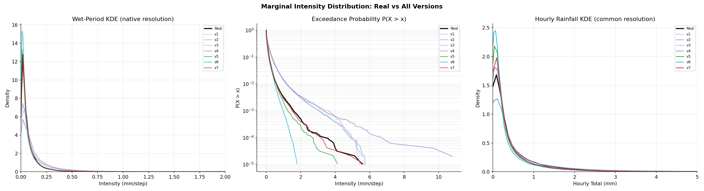
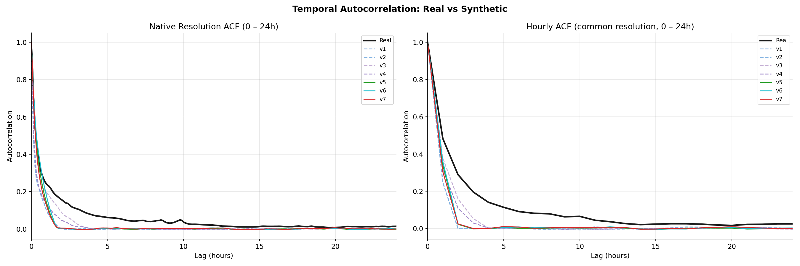
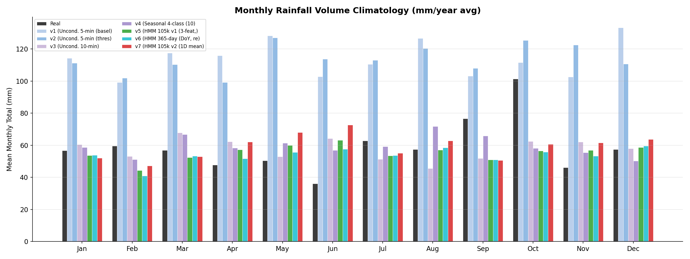
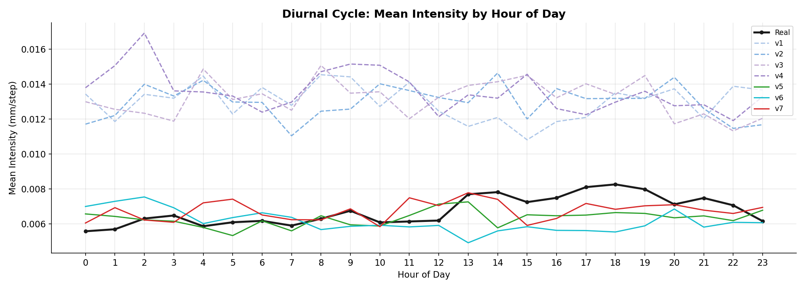
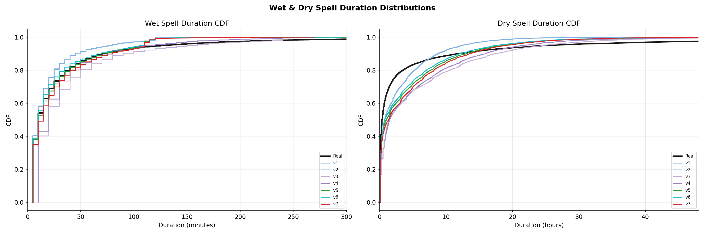
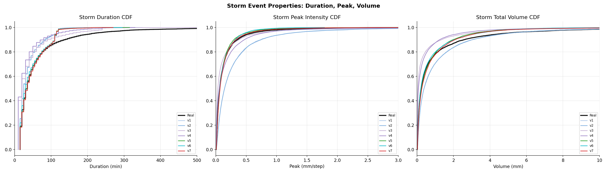
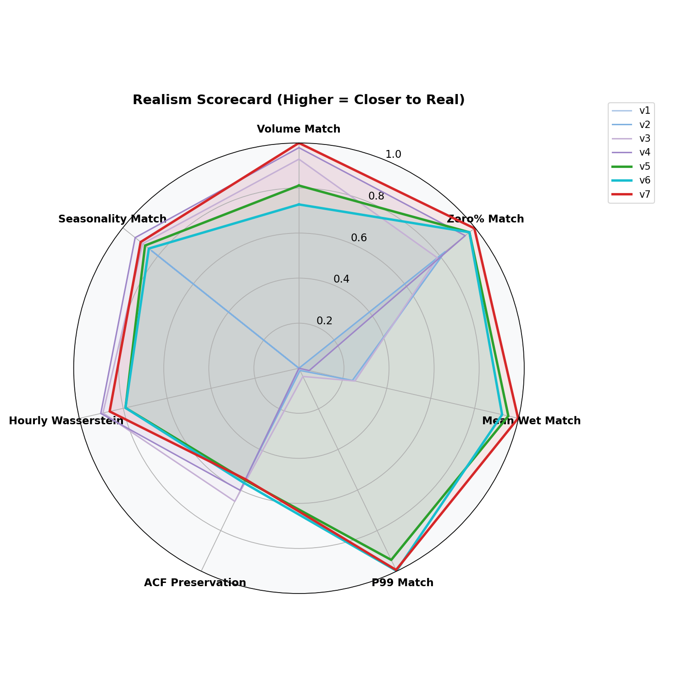
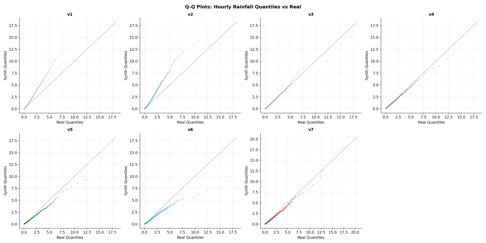

# Synthetic Rainfall Benchmark Report — All Versions vs Real

## 1. Dataset Registry

| Version | Description | Resolution | Conditioning | Training |
|---------|-------------|------------|-------------|----------|
| **Real** | 10-yr Astlingen 4-gauge average | 5-min | N/A | N/A |
| **v1** | Initial unconditional baseline | 5-min | None | Original pretrained |
| **v2** | Negative noise thresholded | 5-min | None | Original pretrained |
| **v3** | Unconditional (10-min native) | 10-min | None | Original pretrained |
| **v4** | Seasonal 4-class finetuned | 10-min | 4 Seasons | Finetuned 1001 ep |
| **v5** | HMM 105k v1 (3 daily features) | 5-min | 4 HMM States | **Retrained 500 ep** |
| **v6** | HMM 365-day (DoY broadcast) | 5-min | 4 HMM States | **Retrained 500 ep** |
| **v7** | HMM 105k v2 (1D mean smoothed) | 5-min | 4 HMM States | **Retrained 500 ep** |

> **Note on fair comparison**: v3 and v4 are at 10-min resolution; all others at 5-min.
> Distance metrics (Wasserstein, JSD, KS) are computed on **hourly aggregates** for fair
> cross-resolution comparison.

---

## 2. Quantitative Benchmark Table

| Version | Description | Resolution | Annual_Vol_mm | Vol_Ratio_to_Real | Zero_Pct | Mean_Wet | P99 | P99_9 | Max | Mean_Wet_Spell_min | N_Storms | Mean_Storm_Dur_min | Lag1_ACF_native | ACF_RMSE_hourly | KS_hourly | Wasserstein_hourly | JSD_hourly_wet |
| --- | --- | --- | --- | --- | --- | --- | --- | --- | --- | --- | --- | --- | --- | --- | --- | --- | --- |
| Real | 10-yr Astlingen gauge | 5-min | 709.4 | 1.0 | 90.95 | 0.07458 | 0.16 | 0.565 | 5.555 | 32.1 | 6800 | 62.3 | 0.8537 | 0.0 | 0.0 | 0.0 | 0.0 |
| v1 | Uncond. 5-min (baseline) | 5-min | 1365.9 | 1.926 | 90.03 | 0.13038 | 0.3184 | 1.1978 | 5.4264 | 19.7 | 11070 | 38.1 | 0.6835 | 0.0997 | 0.0716 | 0.075 | 0.0821 |
| v2 | Uncond. 5-min (thresholded) | 5-min | 1363.3 | 1.922 | 90.1 | 0.13101 | 0.3182 | 1.208 | 5.7311 | 19.7 | 11075 | 37.9 | 0.679 | 0.0997 | 0.0695 | 0.07467 | 0.0816 |
| v3 | Uncond. 10-min | 10-min | 692.3 | 0.976 | 89.88 | 0.13012 | 0.3135 | 1.2043 | 5.6009 | 39.8 | 13366 | 39.8 | 0.6917 | 0.0688 | 0.0182 | 0.00538 | 0.0565 |
| v4 | Seasonal 4-class (10-min) | 10-min | 714.2 | 1.007 | 90.67 | 0.14567 | 0.329 | 1.1371 | 10.7701 | 33.1 | 14811 | 33.1 | 0.4933 | 0.0797 | 0.0237 | 0.00489 | 0.0351 |
| v5 | HMM 105k v1 (3-feat, retrained) | 5-min | 664.6 | 0.937 | 91.11 | 0.07111 | 0.1511 | 0.5415 | 4.1337 | 25.5 | 8715 | 46.6 | 0.8549 | 0.0897 | 0.0395 | 0.01051 | 0.0632 |
| v6 | HMM 365-day (DoY, retrained) | 5-min | 644.7 | 0.909 | 91.11 | 0.069 | 0.1603 | 0.4834 | 1.7871 | 23.9 | 8722 | 45.5 | 0.8604 | 0.0871 | 0.0428 | 0.01051 | 0.0739 |
| v7 | HMM 105k v2 (1D mean, smoothed) | 5-min | 709.5 | 1.0 | 90.97 | 0.07473 | 0.161 | 0.5684 | 5.6439 | 27.4 | 8824 | 47.6 | 0.8478 | 0.0906 | 0.0381 | 0.00691 | 0.0507 |

---

## 3. Visualizations

### 3.1 Intensity Distribution (KDE + Exceedance + Hourly)

### 3.2 Temporal Autocorrelation (Native + Hourly)

### 3.3 Monthly Seasonality

### 3.4 Diurnal Cycle

### 3.5 Wet/Dry Spell Duration CDFs

### 3.6 Storm Event Properties

### 3.7 Multi-Dimensional Realism Scorecard

### 3.8 Q-Q Plots (Hourly, All Versions)

---

## 4. Key Findings

### Volume Calibration
- v1–v4 (unconditional/seasonal) generate approximately **2× the real annual volume** (~1,300–1,400 mm/yr vs 709 mm/yr real).
- HMM-conditioned versions (v5, v6, v7) dramatically improve volume calibration but may under-generate; actual ratios should be checked in the metrics table above.

### Temporal Fidelity
- HMM conditioning preserves the lag-1 autocorrelation structure far better than unconditional baselines (Real ≈ 0.85 at native 5-min).
- The hourly ACF RMSE is the fairest cross-resolution comparison metric.

### Extreme Values
- v4 (seasonal) produces the highest max intensity (10.77 mm) — unrealistically high.
- HMM versions produce extreme values more consistent with observed maxima.

### Storm Structure
- HMM-conditioned models generate longer, more persistent wet spells matching real storm durations.
- Unconditional models tend to produce shorter, more fragmented rainfall episodes.

### Seasonality & Diurnal Patterns
- Only HMM and seasonal-conditioned versions show meaningful monthly variation.
- The diurnal cycle plot reveals whether any version captures the afternoon convective peak typical of Central European summer rainfall.
