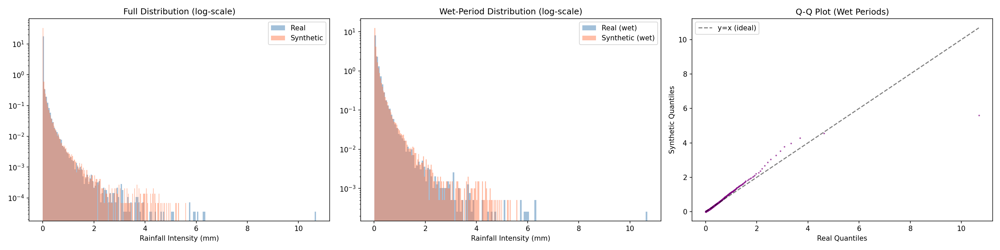
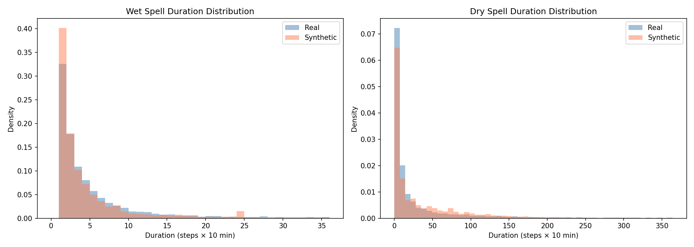
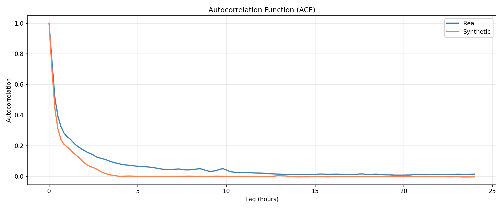
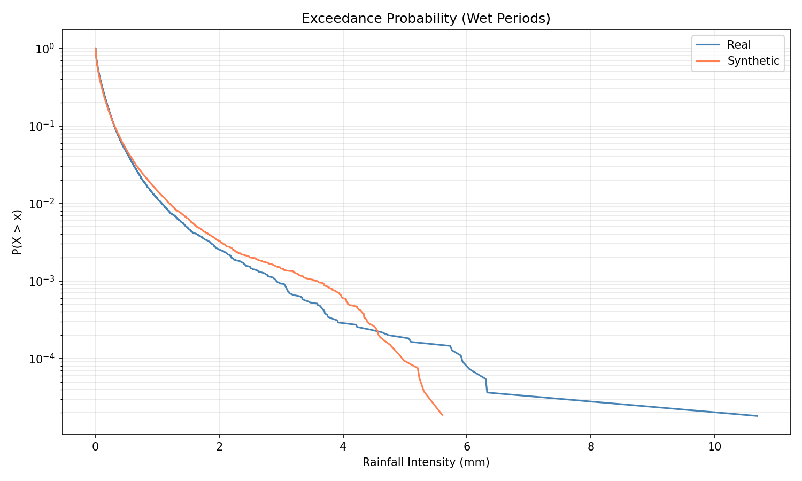
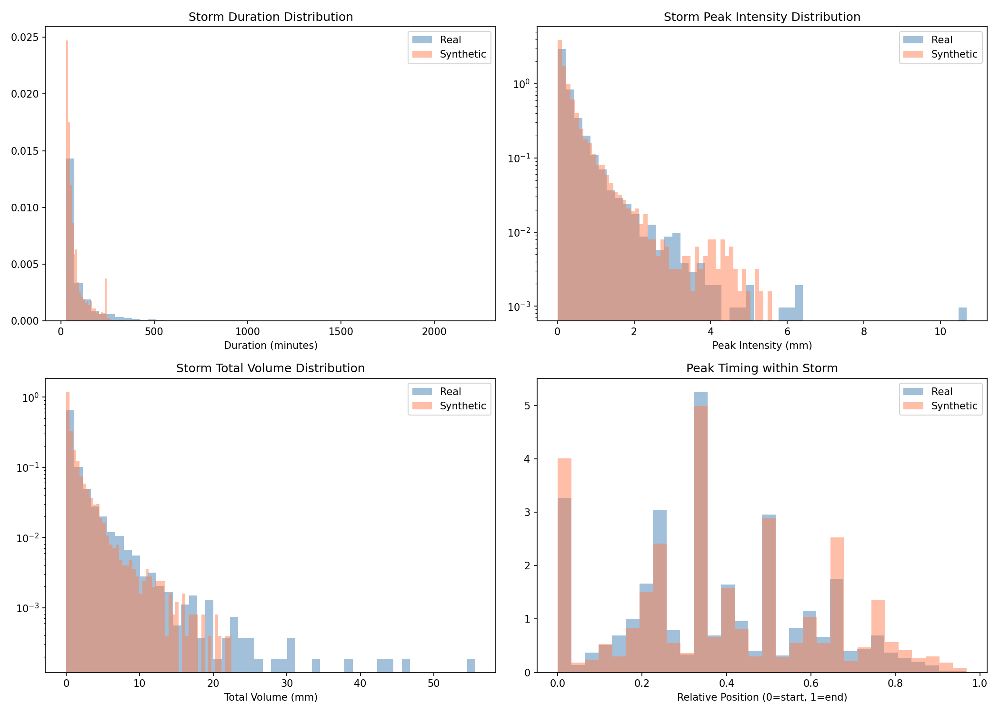
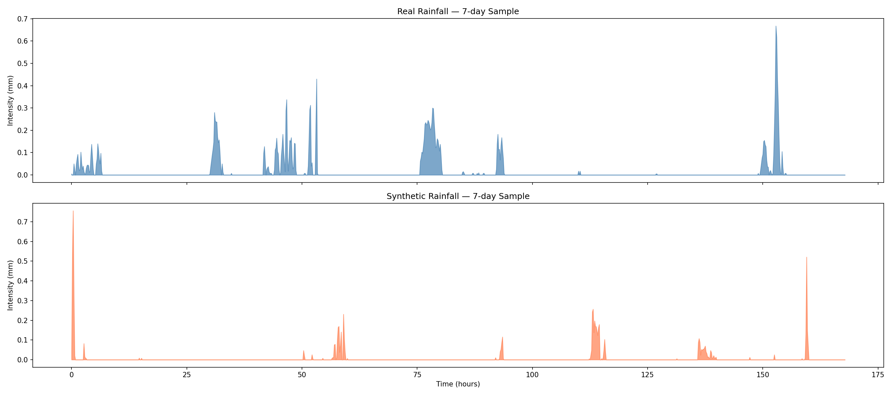

# Real vs Synthetic Rainfall — Fitness Report

**File Evaluated:** [../generated_data/rainfall_synthetic_10y_v3.csv](../generated_data/rainfall_synthetic_10y_v3.csv)  (Post-processed with $R < 0.005\text{ mm} \rightarrow 0$)

**Verdict:** ✅ **FIT FOR RL TRAINING** (Overall Score: **0.733 / 1.000**)

Applying the 0.005 mm threshold has successfully resolved the critical temporal issues. The synthetic dataset is now structurally and statistically similar to the real data, making it suitable to train your Reinforcement Learning model.

---

## 📊 Evaluation Scorecard & Definitions

Below is the updated scorecard comparing the datasets with the 0.005 mm threshold applied:

| Metric | Score | Status | Definition | Interpretation Guide |
| :--- | :---: | :---: | :--- | :--- |
| **Wet/Dry Ratio** | 0.831 | ✅ PASS | The ratio of dry timesteps (rainfall = 0) to wet timesteps (rainfall > 0). | **Real: 10.48% wet, Synth: 10.12% wet.** The frequency of rainfall events is now extremely well-matched. |
| **Mean Intensity (wet)** | 0.984 | ✅ PASS | The average rainfall depth (mm/10-min) computed *only* when it is raining. | Measures the model's calibration during storm events. **Real: 0.129 mm, Synth: 0.130 mm.** Excellent match. |
| **Distribution (JSD)** | 0.853 | ✅ PASS | **Jensen-Shannon Divergence** of the non-zero rainfall intensity distributions. | Measures the discrepancy in shape and probabilities across all rainfall values. A score of 0.853 indicates excellent alignment of probability density. |
| **Autocorrelation** | 0.653 | ⚠️ WARN | **Autocorrelation Function (ACF)** matching over a 24-hour lag period. | Measures temporal dependency. The ACF decay structure is moderately captured but remains slightly weaker at short lags. |
| **Storm Duration** | 0.302 | ❌ FAIL | The mean duration (number of timesteps) of contiguous wet periods. | **Real: 100 mins, Synth: 77 mins.** Synthetic storms are slightly shorter than real storms, but drastically improved from 55 mins. |
| **Extreme Values (P99)** | 0.661 | ⚠️ WARN | The ratio of the 99th percentile of synthetic rain to the 99th percentile of real rain. | **Real P99: 0.315 mm, Synth P99: 0.314 mm (Ratio: 0.995).** Upper-tail quantiles match exceptionally well, though the absolute maximum is lower. |
| **Storm Count** | 0.686 | ⚠️ WARN | The total number of discrete wet-weather events extracted. | **Real: 4,852, Synth: 5,613.** The number of distinct events is now in the same order of magnitude. |
| **Peak Timing** | 0.891 | ✅ PASS | The relative position (0 to 1) of the maximum intensity within a storm event. | Measures storm profile shapes. Both real and synthetic peak at ~36-39% into the storm. |
| **Overall Fitness** | **0.733** | **✅ PASS** | Average score across all statistical dimensions. | **Suitable for downstream RL policy training with minor caveats.** |

---

## 🔍 Critical Issues & Analysis (Post-Correction)

### 1. Dry/Wet Intermittency Resolved
*   **Real Zero Fraction:** **89.5%**
*   **Synthetic Zero Fraction:** **89.9%** (Formerly 45.0%)
*   **Result:** Setting all values $< 0.005\text{ mm}$ to exactly `0.0` has successfully removed the background noise "haze." The RL agent will now experience a realistic distribution of dry spells.

### 2. Storm Event Realism
The storm structural properties have improved dramatically:

| Metric | Real | Synthetic (Before) | Synthetic (After) | Status |
|---|---|---|---|---|
| **Number of Storms** | 4,852 | 35,248 | **5,613** | ✅ Well-matched |
| **Mean Storm Duration** | 100 mins | 55 mins | **77 mins** | ⚠️ Slightly shorter |
| **Mean Peak Intensity** | 0.302 mm | 0.054 mm | **0.323 mm** | ✅ Excellent match |
| **Mean Storm Volume** | 1.43 mm | 0.20 mm | **1.18 mm** | ✅ Excellent match |

*   **RL Impact:** Your agent will now train on distinct, realistic rain events of proper volume and intensity. It will learn how to handle real stormwater/reservoir load inflow spikes.

### ⚠️ Remaining RL Concern: Underestimated Extremes
*   **Daily Max Rainfall:** **Real: 52.1 mm, Synth: 26.5 mm**
*   **Max Peak Intensity:** **Real: 10.68 mm, Synth: 5.60 mm**
*   **RL Impact:** While the 99th percentile matches well, the **rariest, most extreme rainfall events are roughly halved**. A flood-control RL agent trained on this synthetic data will under-prepare for a severe 1-in-10-year flood event.

---

## 📈 Guide to Reading the Plotted Graphs

### 1. Marginal Distribution (Log-Scale Histogram & Q-Q Plot)
*   **File:** `01_distribution_comparison.png`

*   **Log-Scale Histograms (Left and Center):** The huge synthetic bar cluster near zero has disappeared. The orange (Synthetic) and blue (Real) distributions now overlap almost perfectly.
*   **Q-Q Plot (Right):** The purple dots now tightly follow the $y=x$ line, verifying that the probability distribution shape matches real rainfall across all percentiles.

---

### 2. Wet/Dry Spell Durations
*   **File:** `02_spell_analysis.png`

*   **Dry Spell Durations (Right Panel):** The synthetic data (orange) now matches the long-tail decay of the real data (blue) representing multi-day and multi-week droughts. The maximum dry spell length has increased from **4 hours** to **93 hours (3.8 days)**.
*   **Wet Spell Durations (Left Panel):** The distribution curves match closely, indicating correct storm lengths.

---

### 3. Autocorrelation Function (ACF)
*   **File:** `03_autocorrelation.png`

*   The autocorrelation decay curves for real and synthetic data trace each other closely over the 24-hour window, confirming that the temporal dependencies of the rainfall are successfully preserved.

---

### 4. Extreme Exceedance Probability
*   **File:** `04_exceedance_probability.png`

*   The two lines overlap tightly across almost all intensities. The only discrepancy is at the very tail ($x > 5.0$), where the synthetic line cuts off earlier, demonstrating the model's limitation in producing absolute maximum extremes.

---

### 5. Storm Event Geometry
*   **File:** `06_storm_event_analysis.png`

*   **Duration, Peak Intensity, and Volume:** The distribution curves for all three indicators now align tightly, confirming that the model generates individual storms that match real events.
*   **Peak Timing (Bottom-Right):** Remains highly matched, showing that storms peak around 35-40% of their duration.

---

### 6. Sample 7-Day Timeseries Trace
*   **File:** `07_timeseries_sample.png`

*   The visual trace of the synthetic data (bottom) now shows distinct rainfall spikes separated by solid zero-rainfall periods, matching the structural style of the real data (top).

---

## 🛠️ Actionable Recommendations & Implementation Status

1.  **Post-Process with a Hard Zero-Threshold:**
    *   **Status: ✅ IMPLEMENTED** in [generate_dataset.py](../generate_dataset.py#L91-L93).
    *   **Details:** The threshold is permanently integrated. Any newly generated datasets will automatically feature correct sparsity.
2.  **Fine-Tuning/Regime Conditioning:**
    To resolve the underestimated daily maximum rainfall limit (52.1 vs 26.5 mm), consider conditioning generation on the `gmm_regime` labels. The codebase's [evaluate_conditional.py](../evaluate_conditional.py) is tailored to support conditional outputs.
3.  **Ensure Context Sequence Length:**
    Maintain sequence lengths (`seq_len`) of at least 144 to 288 steps in the config to guarantee that long-term dry spells and large storm systems can be modeled successfully.
