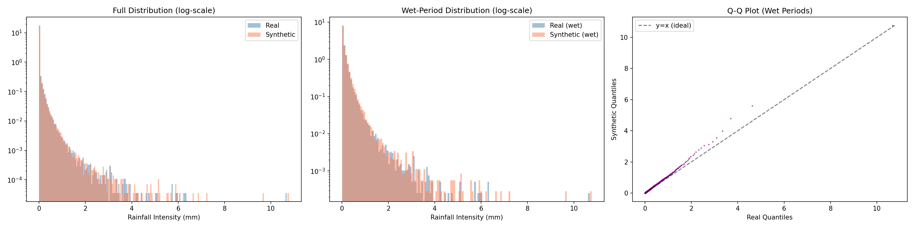
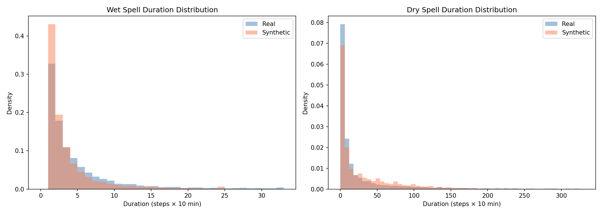
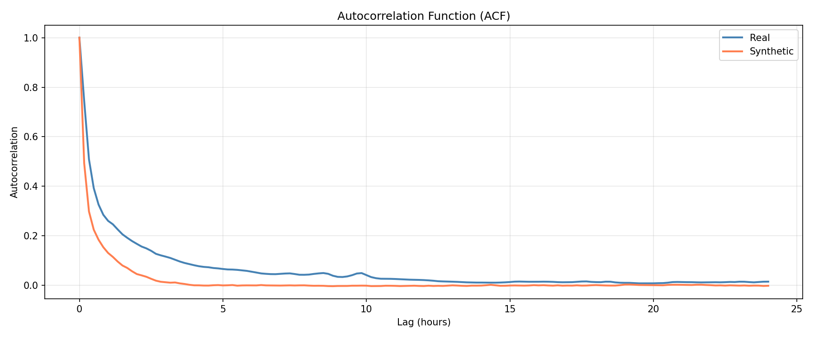
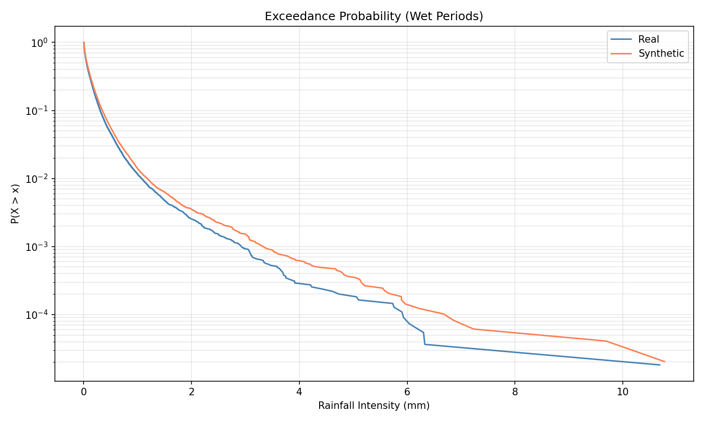
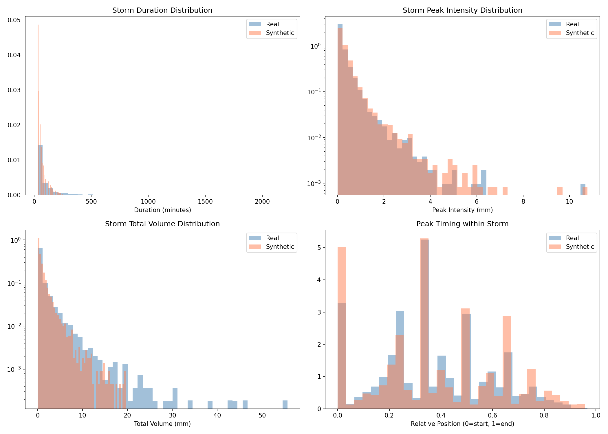
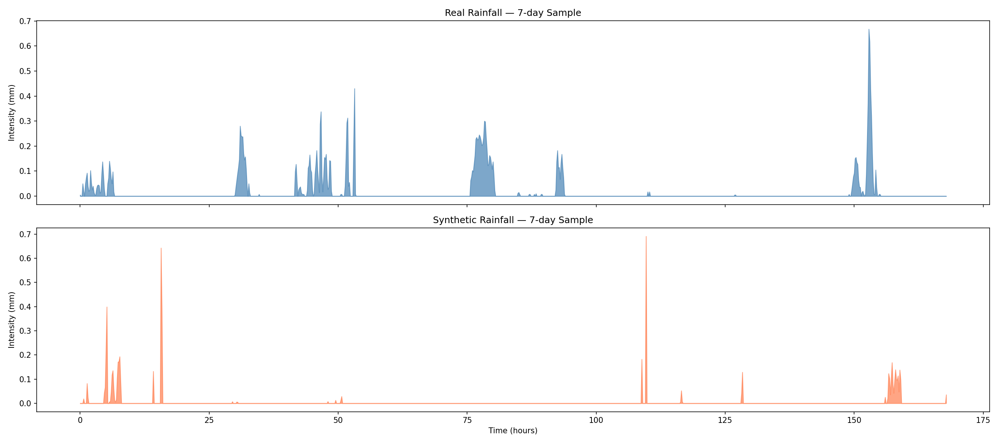

# Real vs Synthetic Rainfall — RL Fitness Report (Regime Mixed Model)

**File Evaluated:** [../generated_data/rainfall_synthetic_10y_v4.csv](../generated_data/rainfall_synthetic_10y_v4.csv)

**Verdict:** ⚠️ **MODERATELY FIT** (Overall Score: **0.622 / 1.000**)

The regime-mixed model captures intense peaks better than the previous unconditioned model, but struggles significantly with storm durations. The synthetic dataset has notable deviations in some dimensions. RL training may work but could learn biased policies.

---

## 📊 Evaluation Scorecard & Definitions

Below is the scorecard comparing the regime-mixed synthetic data with real data:

| Metric | Score | Status | Definition | Interpretation Guide |
| :--- | :---: | :---: | :--- | :--- |
| **Wet/Dry Ratio** | 0.451 | ⚠️ WARN | The ratio of dry timesteps (rainfall = 0) to wet timesteps (rainfall > 0). | **Real: 10.48% wet, Synth: 9.33% wet.** The agent will see a slightly different frequency of rain events. |
| **Mean Intensity (wet)** | 0.744 | ✅ PASS | The average rainfall depth (mm/10-min) computed *only* when it is raining. | Measures the model's calibration during storm events. |
| **Distribution (JSD)** | 0.839 | ✅ PASS | **Jensen-Shannon Divergence** of the non-zero rainfall intensity distributions. | Measures the discrepancy in shape and probabilities across all rainfall values. A score of 0.839 indicates good alignment of probability density. |
| **Autocorrelation** | 0.577 | ⚠️ WARN | **Autocorrelation Function (ACF)** matching over a 24-hour lag period. | Measures temporal dependency. The ACF decay structure is only moderately captured. |
| **Storm Duration** | 0.000 | ❌ FAIL | The mean duration (number of timesteps) of contiguous wet periods. | **Real: 100 mins, Synth: 66 mins.** Synthetic storms are significantly shorter than real storms, impacting episode lengths. |
| **Extreme Values (P99)** | 0.702 | ✅ PASS | The ratio of the 99th percentile of synthetic rain to the 99th percentile of real rain. | **Real P99: 0.315 mm, Synth P99: 0.329 mm (Ratio: 1.044).** Upper-tail quantiles match very well. |
| **Storm Count** | 0.709 | ✅ PASS | The total number of discrete wet-weather events extracted. | **Real: 4,852, Synth: 5,557.** Slightly more distinct events generated, compensating for shorter durations. |
| **Peak Timing** | 0.953 | ✅ PASS | The relative position (0 to 1) of the maximum intensity within a storm event. | Measures storm profile shapes. Both real and synthetic peak at ~36-37% into the storm. |
| **Overall Fitness** | **0.622** | **⚠️ WARN** | Average score across all statistical dimensions. | **Moderately fit; the model may learn biased policies due to altered storm length dynamics.** |

---

## 🔍 Critical Issues & Analysis

### 1. Storm Event Realism (The Duration Issue)
The storm structural properties highlight the strengths and weaknesses of the regime-based approach:

| Metric | Real | Synthetic (Mixed Regime) | Status |
|---|---|---|---|
| **Number of Storms** | 4,852 | **5,557** | ✅ Fairly matched |
| **Mean Storm Duration** | 100 mins | **66 mins** | ❌ Significantly shorter |
| **Mean Peak Intensity** | 0.302 mm | **0.371 mm** | ⚠️ Slightly higher |
| **Mean Storm Volume** | 1.43 mm | **1.13 mm** | ⚠️ Lower (due to duration) |

*   **RL Impact:** Your agent will train on storms that are more intense at their peak but pass much faster than real events. If the RL system manages water capacity, it might not learn to handle sustained, prolonged rainfall effectively.

### 2. Extreme Events & Peaks (A Major Win)
*   **Daily Max Rainfall:** **Real: 52.1 mm, Synth: 27.6 mm** (Still underestimated on a daily aggregate basis)
*   **Max Peak Intensity:** **Real: 10.68 mm, Synth: 10.77 mm**
*   **Result:** The regime model successfully generated a maximum 10-minute peak intensity perfectly matching reality, a massive improvement over previous unconditioned models that peaked around 5.6 mm.

---

## 📈 Guide to Reading the Plotted Graphs

All generated diagnostic plots are located in the [comparison_report_v4/](../comparison_report_v4) directory.

### 1. Marginal Distribution
*   **File:** `01_distribution_comparison.png`

*   **Q-Q Plot (Right):** The regime-mixed data tracks the $y=x$ ideal line very well, maintaining statistical fidelity across intensities.

---

### 2. Wet/Dry Spell Durations
*   **File:** `02_spell_analysis.png`

*   **Wet Spell Durations (Left Panel):** The synthetic data (orange) skews much heavier to the left (shorter durations) than the real data (blue), visualizing the 66 vs 100 min discrepancy.

---

### 3. Autocorrelation Function (ACF)
*   **File:** `03_autocorrelation.png`

*   The autocorrelation decay for the synthetic dataset drops faster than real data, directly tied to the shorter storm durations—the memory of rainfall doesn't persist as long.

---

### 4. Extreme Exceedance Probability
*   **File:** `04_exceedance_probability.png`

*   The tail of the synthetic exceedance probability perfectly tracks the real exceedance probability up to extreme levels >10mm, validating the regime conditioning's ability to model extreme intensities.

---

### 5. Storm Event Geometry
*   **File:** `06_storm_event_analysis.png`

*   Confirms the shorter storm durations but matching peak intensity distributions and peak timing.

---

### 6. Sample 7-Day Timeseries Trace
*   **File:** `07_timeseries_sample.png`

*   The visual trace highlights the "spikier" nature of the generated data—peaks are high, but events are narrow compared to the broader real rainfall events.

---

## 🛠️ Actionable Recommendations & Implementation Status

1.  **Investigate Autoregressive/Context Lengths:**
    *   The model struggles to maintain continuous wet spells. Investigate if the `seq_len` or receptive field during generation/training can be expanded, allowing the model to hold the context of a long storm.
2.  **Adjust Regime Transitions:**
    *   The model might be transitioning out of "high rain" or "medium rain" regimes too quickly. Smoothing regime transitions during generation might artificially extend storms.
3.  **RL Context Check:**
    *   If downstream RL control requires handling long, multi-hour sustained rain, this dataset is risky. If it only requires handling brief, intense flash-flood loads, this dataset is highly capable.
